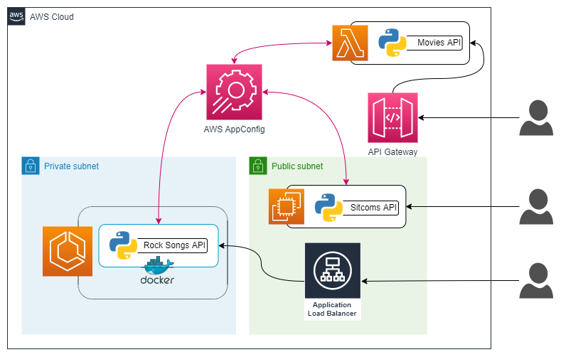

# Full AppConfig Demo using EC2, Lambda and ECS.

This terraforming implementation is intended to be used as a proof of concept on how to harness the power of AWS AppConfig. In this POC, an AppConfig configuration profile is implemented and 3 APIs running on different systems (EC2, ECS and Lambda) get configuration from it.

## Resources deployed by this manifest:

- AppConfig Module:
    - Application
    - Configuration Profile
    - Validator
    - Environment
    - Hosted Configuration
    - Deployment Strategy
    - Apply AppConfig Deployment
- VPC Module:
    - VPC
    - 2 Public Subnet
    - 2 Private Subnet
    - 1 Internet Gateway
    - 2 EIP for the NAT Gateway
    - 2 NAT Gateway
    - Default Route Table
    - 2 Private Route Table
    - CloudWatch Log Group (For VPC Flow Logs).
    - VPC Flow Logs
- Lambda Module:
    - Python Lambda Function
    - IAM Role
    - API Gateway 
- EC2 Module:
    - Public Linux Instance running a Python API
    - Build trigger to push source files to the instance and run the app
    - IAM Role to allow instance to get AppConfig Configuration
    - Security group with whitelisted User IP (obtained automatically)
- ECS Module:
    - ECR
    - Python Docker Container 
    - ECS Cluster
    - ECS Task (Python API)
    - IAM Role to allow container to get AppConfig Configuration.
    - ALB
    - Security Groups
    - CloudWatch Log Group
    - CloudWatch Log Stream
    - Auto Scaling Policy

### Deployment diagram:



>:arrow_right: For simplicity reasons, not all the resources are represented in the diagram :arrow_left:

## Tested with: 

| Environment | Application | Version  |
| ----------------- |-----------|---------|
| WSL2 Ubuntu 20.04 | Terraform | v1.1.8  |
| WSL2 Ubuntu 20.04 | AWS-CLI | v2.5.3 |

## Initialization How-To:

Located in the root directory, make an "aws configure" to log into the aws account, and a "terraform init" to download the necessary modules and start the backend.

```bash
aws configure
terraform init
```

```bash
# Find all files with the keyword 'CTesting' and replace them with 'default'.
find $(pwd) -type f -exec sed -i 's/CTesting/defualt/gI' {} \;

# List all .tf, .sh, Dockerfile and .py files with the keyword 'us-east-1'
find $(pwd) -iregex '.*\.\(tf\|sh\|Dockerfile\|py\)$' -exec grep -li 'us-east-1' {} \;

# Find all .tf, .sh, Dockerfile and .py files with the keyword 'REGION-X' and replace them with 'REGION-Y'.
find $(pwd) -iregex '.*\.\(tf\|sh\|Dockerfile\|py\)$' -exec sed -i 's/REGION-X/REGION-Y/gI'
```

## Deployment How-To:

Located in the root directory, make the necessary changes in the variables.tf file and run the manifests:

```bash
terraform apply
```

#### **Debugging Tip #1**: 

#### **Known issue #1**: 
 - **Issue**: 
    - You get one of the following errors when trying to push the image to ECR from a WSL2 + Docker Desktop installation.
        - ```Error saving credentials: error storing credentials - err: exit status255, out: ```
        - ```no basic auth credentials ```
- **Cause**: 
    - Bug in in a Docker Desktop update.
- **Solution**:
    - In the ~/.docker/config.json file, change **credsStore** to **credStore**.
    - Change the **credStore** value to **"desktop.exe"**

**Note**: You may also need to take the following actions:

```bash
docker logout
mv ~/.docker/config.json ~/.docker/config-OLD.json
```

#### **Known issue #2**: 
 - **Issue**: 
    - If you destroy the deployment and then try to apply it against it, you'll get:
        - Error: Creating CloudWatch Log Group failed: ResourceAlreadyExistsException: The specified log group already exists:  The CloudWatch Log Group 'VPCFlowLogs' already exists.
- **Cause**: 
    - Since CloudWatch Log Group has a retention policy, the destroy command does not delete it.
- **Solution**:
    - Delete the CloudWatch log group using the provided script:

```bash
bash modules/vpc/scripts/delete_log_group.sh
```
## Author:

- [@JManzur](https://jmanzur.com)

## Documentation:

- [AWS AppConfig Helper - Documentation](https://github.com/aws-samples/sample-python-helper-aws-appconfig)
- [Boto3 AppConfig - Documentation](https://boto3.amazonaws.com/v1/documentation/api/latest/reference/services/appconfig.html)